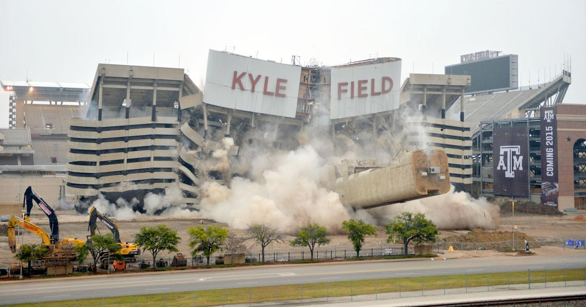
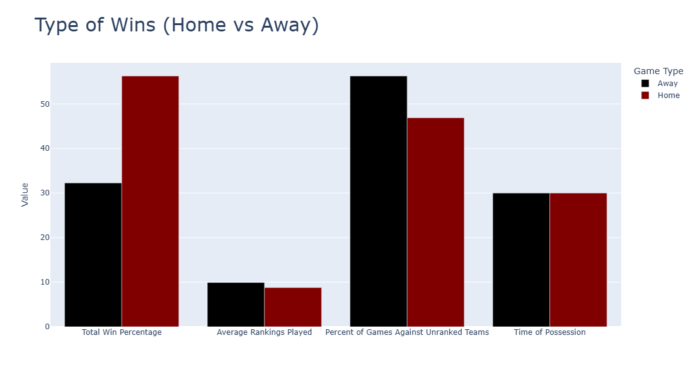
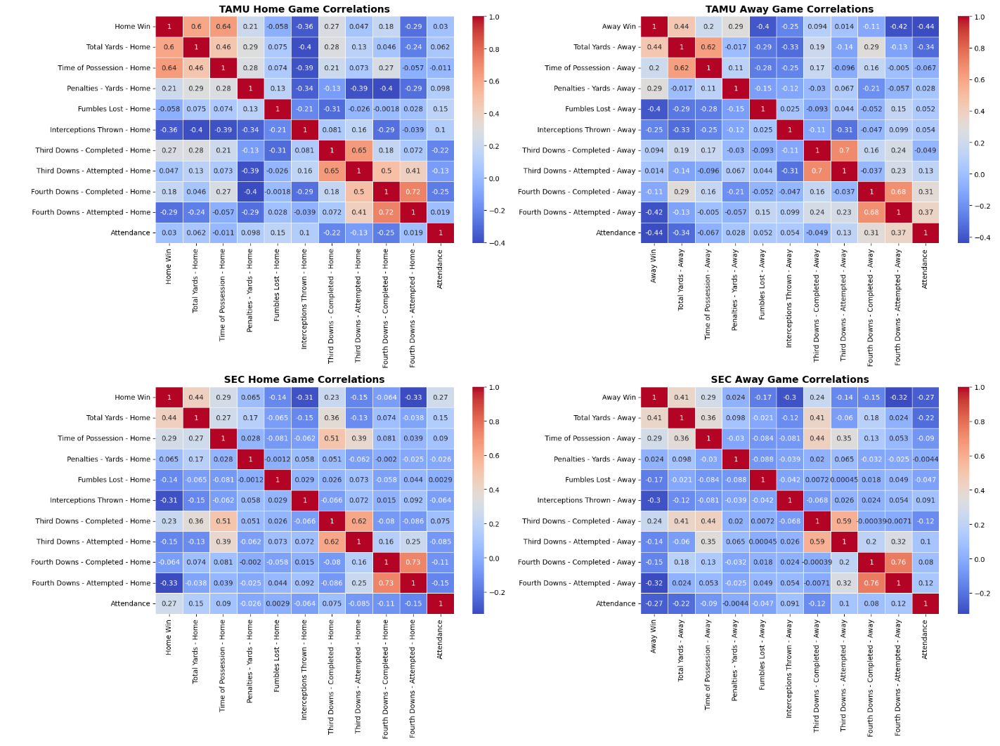
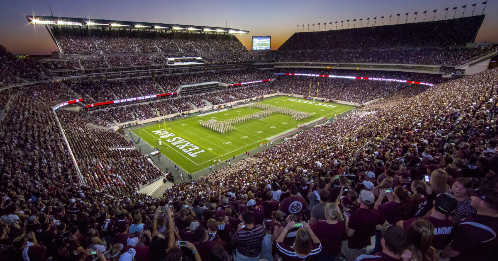

# Texas A&M Football Performance Analysis - *KyleField_HomeField*
### Kyle Field Renovations

## Project Overview: Post-2015 Kyle Field Renovations - Texas A&M's Home-Field Advantage

This project analyzes Texas A&M’s football performance at home vs. away after the 2015 Kyle Field renovation. The goal is to determine whether Kyle Field provides a significant home-field advantage by comparing key performance metrics to the rest of the SEC.

---

## **Technologies Used**  
- **Python** (Pandas, NumPy, Matplotlib, Seaborn, Plotly)  
- **Jupyter Notebook** for data cleaning and analysis

---
## **Key Questions Answered:**  
- Does Texas A&M perform better at home compared to away games?  
- How does their home-field advantage compare to other SEC teams?  
- What factors contribute most to their home success?

--- 
## Dataset
- **Source:** [College Football Game Stats | 2002 to January 2025](https://www.kaggle.com/datasets/cviaxmiwnptr/college-football-team-stats-2002-to-january-2024)  
- **Description:** This dataset includes every game involving an NCAA FBS (Division I-A) football team from 2002 through January 2025. It contains game statistics such as:
  - **Team Information:** Names of the competing teams as well as their rankings
  - **Game Outcomes:** Scores, win/loss results  
  - **Offensive Metrics:** Total yards, rushing yards, passing yards  
  - **Defensive Metrics:** Yards allowed, turnovers  
  - **Miscellaneous:** Penalties, time of possession, attendance figures, date and time

---

## Analysis and Key Insights:

1. **Home vs. Away Performance Bar Chart**:
   - Kyle Field shows a clear home-field advantage, with a significantly higher win percentage at home.
   - Despite playing tougher opponents at home (with a higher percentage of ranked teams), A&M's performance at home stands out in comparison to their away games.
   - Time of possession is fairly consistent at home and away, suggesting it’s not the main factor in their home-field advantage.


2. **Offensive Performance Box Chart**:
   - A&M performs better offensively at home, particularly in rushing yards.
   - The variance in total yards is higher at home, indicating more dramatic outcomes in home games, with a higher ceiling and floor for performance.
   
3. **Opponent Strength Comparison**:
   - At home, A&M faces tougher competition with 10% fewer unranked teams, and the average ranking of ranked teams is significantly better than the SEC average for home games.
   - On the road, A&M faces a higher percentage of unranked teams, but the ranked teams they encounter are stronger than the SEC’s average.

4. **Scatter Plot of Attendance vs. Penalty Yards**:
   - There is a slight positive correlation between higher attendance at Kyle Field and the opposing team's penalties, although the correlation is minimal.
   - This suggests that while a larger crowd might play a minor role, it is unlikely to be a major factor in penalties committed by opponents.

5. **Winning Factors and Penalty Analysis**:
   - A&M’s home wins correlate more strongly with total yards and time of possession compared to SEC teams, emphasizing the importance of ball control at Kyle Field.
   - On the road, fumbles have a significantly more negative impact on A&M’s performance than at home.
   - Interestingly, A&M’s penalty yards on the road correlate positively with road wins, an unusual trend compared to the SEC.

6. **Radar Chart**:
   - A&M shows stronger performance at home in terms of points scored and overall offensive production.
   - However, the team allows more points at home than the average SEC team.
   - The radar chart highlights a clear home-field advantage, not only for A&M but across the SEC, with both A&M and the SEC as a whole performing better at home.

---

## Conclusion:
While Texas A&M's home-field advantage, when compared to the SEC average, appears relatively average, the stark contrast between their home and away performance suggests a notable home-field edge. The significant difference in their performance at Kyle Field versus on the road indicates that A&M does, in fact, enjoy a solid home-field advantage. However, the overall picture suggests that the team's struggles on the road and their underperformance post-Johnny Football highlight a broader issue: A&M, despite its home advantage, still falls short as a top-tier football program in recent years.


--- 

## Installation

To run the project on your local machine, follow these steps:

1. Clone the repository:
    ```bash
    git clone https://github.com/drewddudney/KyleField_HomeField.git
    ```

2. Install the required dependencies. You can do so by installing the packages:
    ```bash
    pip install -r requirements.txt
    ```
---
