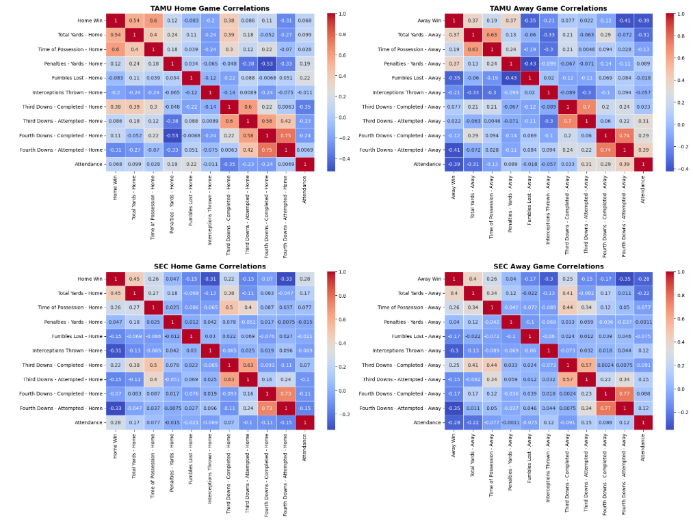

# Texas A&M Football Performance Analysis - *KyleField_HomeField*
### Kyle Field Renovations

## Case Study: Post-2014 Kyle Field Renovations - Texas A&M's Home-Field Advantage

This case study analyzes Texas A&M's football performance at home versus away, focusing specifically on the seasons following the 2014 renovations of Kyle Field. The goal of this study is to evaluate if the new Kyle Field has provided Texas A&M with a true home-field advantage, comparing key performance metrics such as win percentage, offensive performance, and opponent strength. The findings are also compared to the broader SEC to determine if A&M's home-field advantage is among the best in the country.

---

## Visualizations and Key Insights:

1. **Home vs. Away Performance Bar Chart**:
   - Kyle Field shows a clear home-field advantage, with a significantly higher win percentage at home.
   - Despite playing tougher opponents at home (with a higher percentage of ranked teams), A&M's performance at home stands out in comparison to their away games.
   - Time of possession is fairly consistent at home and away, suggesting it’s not the main factor in their home-field advantage.

2. **Offensive Performance Box Chart**:
   - A&M performs better offensively at home, particularly in rushing yards.
   - The variance in total yards is higher at home, indicating more dramatic outcomes in home games, with a higher ceiling and floor for performance.
   
3. **Opponent Strength Comparison**:
   - At home, A&M faces tougher competition with 10% fewer unranked teams, and the average ranking of ranked teams is significantly better than the SEC average for home games.
   - On the road, A&M faces a higher percentage of unranked teams, but the ranked teams they encounter are stronger than the SEC’s average.

4. **Scatter Plot of Attendance vs. Penalty Yards**:
   - There is a slight positive correlation between higher attendance at Kyle Field and the opposing team's penalties, although the correlation is minimal.
   - This suggests that while a larger crowd might play a minor role, it is unlikely to be a major factor in penalties committed by opponents.

5. **Winning Factors and Penalty Analysis**:
   - A&M’s home wins correlate more strongly with total yards and time of possession compared to SEC teams, emphasizing the importance of ball control at Kyle Field.
   - On the road, turnovers (interceptions and fumbles) have a significantly more negative impact on A&M’s performance than at home.
   - Interestingly, A&M’s penalty yards on the road correlate positively with road wins, an unusual trend compared to the SEC.

6. **Radar Chart**:
   - A&M shows stronger performance at home in terms of points scored and overall offensive production.
   - However, the team allows more points at home than the average SEC team.
   - The radar chart highlights a clear home-field advantage, not only for A&M but across the SEC, with both A&M and the SEC as a whole performing better at home.

---

## Conclusion:
While Texas A&M's home-field advantage, when compared to the SEC average, appears relatively average, the stark contrast between their home and away performance suggests a notable home-field edge. The significant difference in their performance at Kyle Field versus on the road indicates that A&M does, in fact, enjoy a solid home-field advantage. However, the overall picture suggests that the team's struggles on the road and their underperformance post-Johnny Football highlight a broader issue: A&M, despite its home advantage, still falls short as a top-tier football program in recent years.

